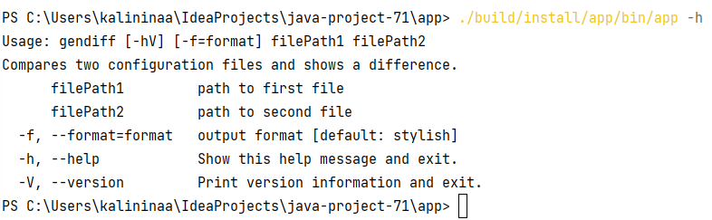
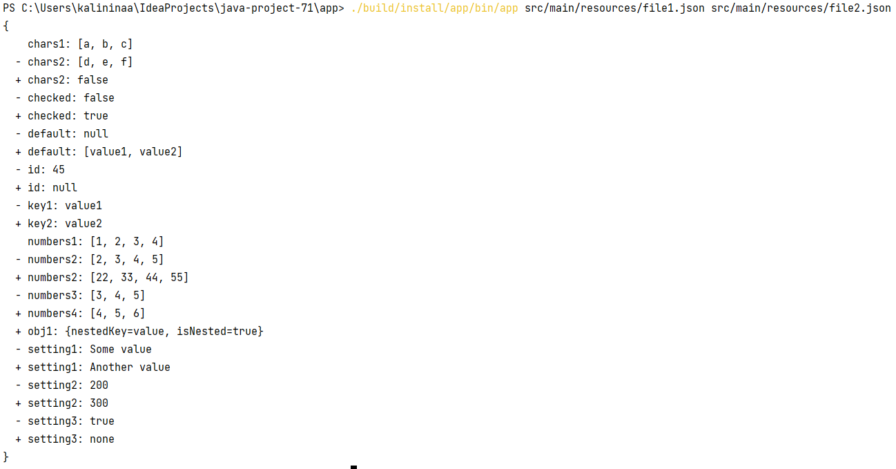
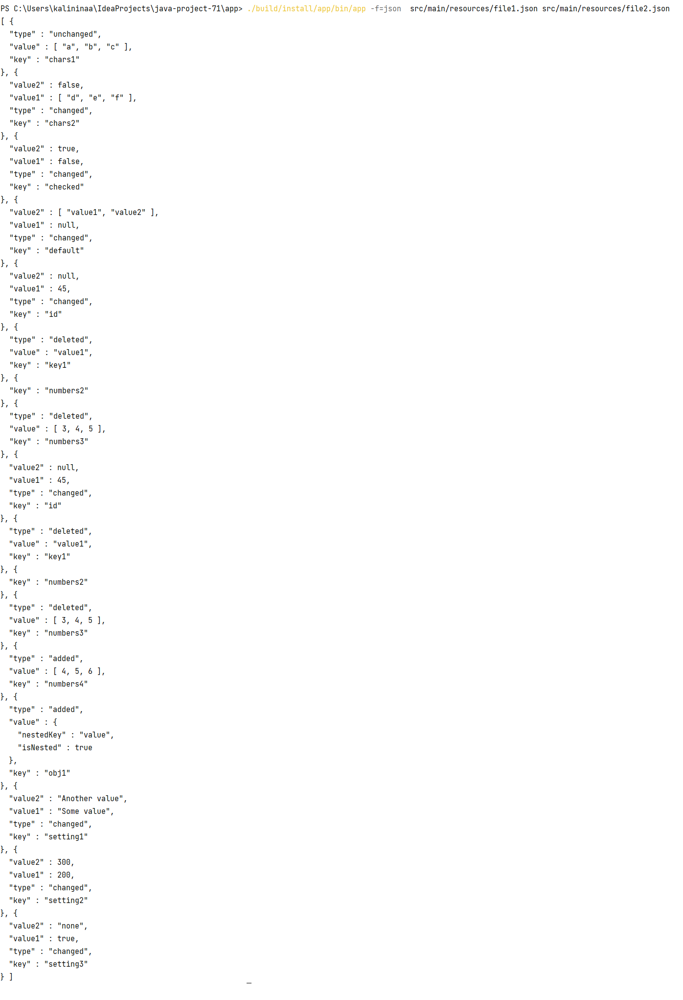
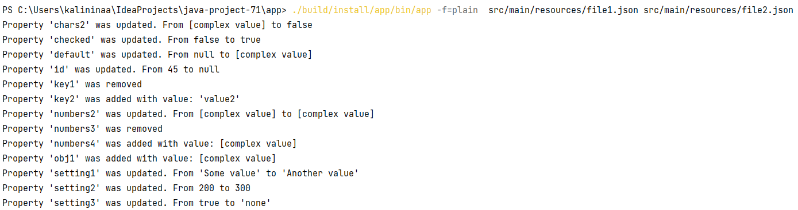

### Hexlet tests and linter status:

# Diff Finder
The source code for a CLI tool that finds the difference between two data structures files

## Help

## Basic flow
Run the program and specify file paths for comparison. The program will take out the difference.:

## Formats
- json
- stylish (the default one)
- plain

## Json

## Stylish

## Plain

